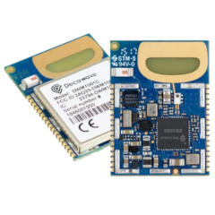
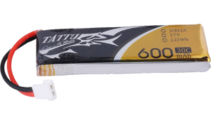
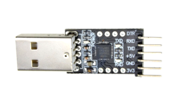
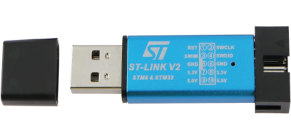
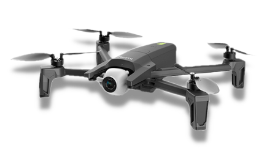
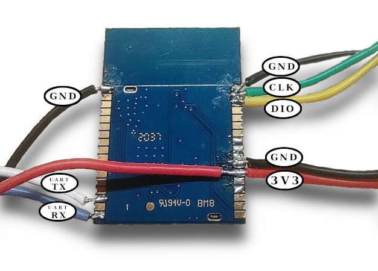
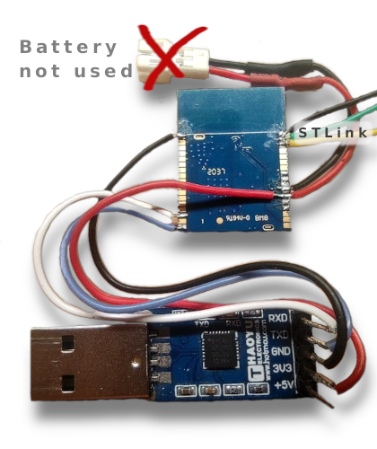
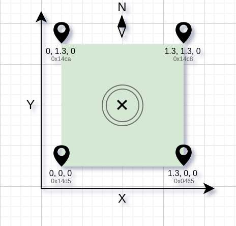

[](https://www.youtube.com/watch?v=BVqrRhzYGXg)
https://www.youtube.com/watch?v=BVqrRhzYGXg

Autonomous landing
==================

Yet another fully autonomous drone precision landing system based on ultra-wideband (UWB) technology. I chose the ANAFI drone for this project because it has an open API, which made it easy for me to integrate my own software. I also chose UWB for the landing system because I found that camera-based approaches, such as landing by QR code, are unreliable.

One of the most important lessons I learned from this project is that UWB precision alone is not sufficient to solve the localization problem. In order to achieve accurate drone localization, it is necessary to fuse altitude and velocity data into the Kalman filter along with distances from the UWB devices.

I found that the Extended Kalman Filter (EKF) works well for this purpose, but the Unscented version of the filter (UKF) is even better, as it produces lower normalized errors in simulations. In my implementation, the filter state contains only position and velocity, and I found that adding acceleration did not improve localization accuracy. It is possible that I made some mistake in my implementation, but I haven't been able to identify it yet.

The autonomous flight sequence begins when the Kalman filter has converged and the drone's position has been localized. The drone is then controlled by three PID controllers: one for X and Y movement, and one for yaw angle. The ANAFI drone descends as quickly as possible until it reaches an altitude of 1 meter, at which point it aligns itself with the center of the landing area and begins a step-by-step descent to the ground. According to my experiments, the drone lands within a radius of 10 centimeters, which is quite good considering that the final descent (the last 30 centimeters to the ground) is controlled by the ANAFI firmware.

I used four UWB anchors spaced 1.3 meters apart to form a square, which provided sufficient accuracy. However, it is possible to use up to eight anchors for even better precision. The measurements refresh rate was 80 Hz, which was only possible to achieve using the custom firmware from [Decawave](https://github.com/Decawave/uwb-apps) (unfortunately, after being acquired by Qorvo, Decawave stopped development and all of their git repositories are now abandoned).

Getting started
===============

This precise landing approach is based on measuring the distance to a landing drone using ultra-wideband (UWB) modules from Qorvo (formerly Decawave) and calculating the relative XYZ coordinates using a Kalman filter. To get started, you will need at least six DWM1001 UWB modules:



There are also development boards on the market (such as the DWM1001-DEV) that have the similar DWM1001 module embedded on top, but these development boards can be bulky, expensive, and frankly, unnecessary for this project.

Why do you need at least six DWM1001 modules? At least four of the modules act as anchors and form a landing square (keep in mind that more anchors result in higher accuracy and reliability of calculations), one module is mounted on the drone and acts as a tag (measuring distances to the anchors and transmitting measurements to a listener module), and one module is a listener of tag measurements, connected to any computer that runs the Kalman filter and controls the drone.

The four anchors (forming the landing square) and the one tag (mounted on the drone) can be powered with any 1S lipo battery:



So, you will need at least five 1S lipo batteries for the four anchors and one tag. Don't forget to also get a 1S parallel lipo charger, as a single DWM1001 can work for up to 4-5 hours on a single charge.

As mentioned above, one module acts as a listener of range measurements and is connected to a computer through a USB serial port adapter:



To flash the DWM1001 module, you will need an STLink programmer:



Finally, you will need a drone itself. I chose the Parrot ANAFI for this project because I like its open API and the ease of integration with any Python script that does localization and controls the drone:



##### So the BOM list looks like the following:

* 6x UWB DWM1001 modules
* 5x 1S lipo battaries
* 1x 1S parallel lipo charger
* 1x USB serial port adapter
* 1x STLink in-circuit programmer
* 1x Parrot ANAFI

Wiring
======

In this approach, I stick to the bare DWM1001 module and not the development version, so the wiring requires a bit of soldering. The anchors and tag modules (a total of five) need ground and power (+3.3v) wires for connecting to a battery, and SWD_CLK and SWD_DIO wires for one-time flashing using the STLink programmer:



For more details, see "DWM1001 PIN CONNECTIONS" diagram in the original [manual](https://www.decawave.com/sites/default/files/dwm1001_datasheet.pdf).

The module that acts as a listener of range measurements and is connected to a computer through a USB serial port adapter requires two additional wires for the UART connection (TX and RX) for complete wiring. In this case, the DWM1001 module is powered directly from the USB serial port adapter, so a battery is not needed.



The green (SWD_CLK) and yellow (SWD_DIO) wires are connected to the STLink programmer once for one-time flashing.


Flashing
========

DWM1001 modules need to be flashed with the UWB firmware from Decawave. Unfortunately, the firmware was abandoned and further development has been stopped after the acquisition by Qorvo, but the [sources](https://github.com/Decawave/uwb-apps) are available on GitHub and there are examples and extensive descriptions of the architecture and used API. In order to receive range measurements on another DWM1001 module, I made a few modifications in my UWB firmware [fork](https://github.com/rouming/uwb-apps).

Here is the complete compilation and flashing process:

##### Install gcc and openocd

Install `gcc-arm-none-eabi` and `openocd` packages on your Linux distribution, for example on Ubuntu:

```no-highlight
sudo apt-get install gcc-arm-none-eabi openocd
```

##### Install Apache Newt

You will need to download the Apache Newt tool, as documented in the [Getting Started Guide](http://mynewt.apache.org/latest/get_started/index.html)

##### Clone precise-landing repository with submodules

```no-highlight
git clone --recurse-submodules https://github.com/rouming/precise-landing.git
cd precise-landing/firmware/uwb-apps
```

##### Download newt packages

Running the ```newt upgrade``` command downloads the apache-mynewt-core, decawave-uwb-core, decawave-uwb-dw1000 driver(s) repo, and mynewt-timescale-lib packages, these are dependent repos of the uwb-apps project and are automatically checked-out by the newt tools:

```no-highlight
newt upgrade
# Depending on what version of the newt tool you use you
# may have to manually remove git-but artifacts and then rerun
# upgrade. I.e. only if you see an error like:
# "Error: Error updating "mcuboot"..." do:
rm repos/mcuboot/ext/mbedtls/include/mbedtls/ -rf
newt upgrade
```

##### Apply any patches to apache-mynewt-core

```no-highlight
cd repos/apache-mynewt-core/
git apply ../decawave-uwb-core/patches/apache-mynewt-core/mynewt_1_7_0_*
cd -
```

##### Build bootloader

Builds bootloader applicaiton for the DWM1001 target. Bootloader should be flashed first for each DWM1001 module regardless of the role:

```no-highlight
newt target create dwm1001_boot
newt target set dwm1001_boot app=@mcuboot/boot/mynewt
newt target set dwm1001_boot bsp=@decawave-uwb-core/hw/bsp/dwm1001
newt target set dwm1001_boot build_profile=optimized
newt build dwm1001_boot

# Execute for _each_ DWM1001 module
newt load dwm1001_boot
```

##### Master module

Only one module among anchors which acts as a master is allowed per network. In this configuration it is possible to have 4 anchors minimum and up to 8 modules:

```no-highlight
newt target create nrng_master
newt target set nrng_master app=apps/twr_nranges_tdma
newt target set nrng_master bsp=@decawave-uwb-core/hw/bsp/dwm1001
newt target set nrng_master build_profile=optimized

# Disable additional debug output
newt target amend nrng_master syscfg=NRNG_VERBOSE=0:SURVEY_ENABLED=0
# Disable RTT and UART
newt target amend nrng_master syscfg=CONSOLE_RTT=0:CONSOLE_UART=0
# Configure number of nodes and frames
newt target amend nrng_master syscfg=NRNG_NFRAMES=16:NRNG_NNODES=8:NRNG_NTAGS=4:NODE_START_SLOT_ID=0:NODE_END_SLOT_ID=7
# Configure role
newt target amend nrng_master syscfg=PANMASTER_ISSUER=1:UWB_TRANSPORT_ROLE=0

newt create-image nrng_master 1.0.0
newt load nrng_master
```

##### Slave modules

All other non-master anchors should be configured as slaves:

```no-highlight
newt target create nrng_slave
newt target set nrng_slave app=apps/twr_nranges_tdma
newt target set nrng_slave bsp=@decawave-uwb-core/hw/bsp/dwm1001
newt target set nrng_slave build_profile=optimized

# Disable additional debug output
newt target amend nrng_slave syscfg=NRNG_VERBOSE=0:SURVEY_ENABLED=0
# Disable RTT and UART
newt target amend nrng_slave syscfg=CONSOLE_RTT=0:CONSOLE_UART=0
# Configure number of nodes and frames
newt target amend nrng_slave syscfg=NRNG_NFRAMES=16:NRNG_NNODES=8:NRNG_NTAGS=4:NODE_START_SLOT_ID=0:NODE_END_SLOT_ID=7
# Configure role
newt target amend nrng_slave syscfg=NRANGES_ANCHOR=1:UWB_TRANSPORT_ROLE=0

newt create-image nrng_slave 1.0.0
newt load nrng_slave
```

##### Tag module

Only one module acts as a tag and is mounted on the ANAFI drone:

```no-highlight
newt target create nrng_tag
newt target set nrng_tag app=apps/twr_nranges_tdma
newt target set nrng_tag bsp=@decawave-uwb-core/hw/bsp/dwm1001
newt target set nrng_tag build_profile=optimized

# Disable additional debug output
newt target amend nrng_tag syscfg=NRNG_VERBOSE=0:SURVEY_ENABLED=0
# Disable RTT and UART
newt target amend nrng_tag syscfg=CONSOLE_RTT=0:CONSOLE_UART=0
# Configure number of nodes and frames
newt target amend nrng_tag syscfg=NRNG_NFRAMES=16:NRNG_NNODES=8:NRNG_NTAGS=4:NODE_START_SLOT_ID=0:NODE_END_SLOT_ID=7
# Configure role
newt target amend nrng_tag syscfg=UWB_TRANSPORT_ROLE=1

newt create-image nrng_tag 1.0.0
newt load nrng_tag
```

##### Listener module

One module acts as a listener of all measured ranges transmitted from a tag. Listener module is connected to the computer via UART and outputs range measurements in JSON:

```no-highlight
newt target create nrng_listener
newt target set nrng_listener app=apps/twr_nranges_tdma
newt target set nrng_listener bsp=@decawave-uwb-core/hw/bsp/dwm1001
newt target set nrng_listener build_profile=optimized

# Disable additional debug output
newt target amend nrng_listener syscfg=NRNG_VERBOSE=0:SURVEY_ENABLED=0
# Disable RTT and enable UART
newt target amend nrng_listener syscfg=CONSOLE_RTT=0:CONSOLE_UART=1:CONSOLE_UART_BAUD=115200
# Configure number of nodes and frames
newt target amend nrng_listener syscfg=NRNG_NFRAMES=16:NRNG_NNODES=8:NRNG_NTAGS=4:NODE_START_SLOT_ID=0:NODE_END_SLOT_ID=7
# Configure role
newt target amend nrng_listener syscfg=UWBCFG_DEF_ROLE='"0x0"':UWB_TRANSPORT_ROLE=2

newt create-image nrng_listener 1.0.0
newt load nrng_listener
```

**!!!!! Don't forget to load bootloader for each module !!!!!**

Ranging
=======

Once all modules are flashed and wired (see [wiring](#wiring) section) we can perform a quick ranging test:

1\. Power master module (one of the anchors acts as a master, see [master module](#master-module) section)

2\. Power tag module (see [tag module](#tag-module) section) and place it not closer than 50cm from the anchor master module.

3\. Connect listener module to a computer via USB serial port adapter and find what USB serial port was detected by the OS, for example let it be the `/dev/ttyUSB0`.

4\. Start the `dwm1001_uart.py` script which fetches range measurements from the listener module and specify UART device:


```no-highlight
./localization/dwm1001_uart.py --dev /dev/ttyUSB0
```

You should get continuos output where tag measures range to the master anchor:

```no-highlight
ts=2.893854 tag=0x16fc [0x14d9: 0.518m]
ts=2.907297 tag=0x16fc [0x14d9: 0.480m]
ts=2.920741 tag=0x16fc [0x14d9: 0.473m]
ts=2.934178 tag=0x16fc [0x14d9: 0.527m]
ts=2.947628 tag=0x16fc [0x14d9: 0.508m]
ts=2.961071 tag=0x16fc [0x14d9: 0.511m]
ts=2.974509 tag=0x16fc [0x14d9: 0.471m]
ts=2.987958 tag=0x16fc [0x14d9: 0.478m]
[cut]
```

The tag has the address `0x16fc` and the master anchor is `0x14d9`, please write down these addresses on sticky paper and mark each module with an address, you will need to know where exactly to place the modules when you start creating the landing area.

5\. Power on another anchor while the script is running. The output will show the address of the new anchor, for example:

```no-highlight
ts=13.159517 tag=0x16fc [0x14d9: 0.464m] [0x14d5: 0.522m]
ts=13.199815 tag=0x16fc [0x14d9: 0.447m] [0x14d5: 0.462m]
ts=13.213265 tag=0x16fc [0x14d9: 0.466m] [0x14d5: 0.485m]
ts=13.226708 tag=0x16fc [0x14d9: 0.483m] [0x14d5: 0.537m]
ts=13.240146 tag=0x16fc [0x14d9: 0.501m] [0x14d5: 0.492m]
ts=13.253595 tag=0x16fc [0x14d9: 0.485m] [0x14d5: 0.532m]
ts=13.267039 tag=0x16fc [0x14d9: 0.508m] [0x14d5: 0.508m]
ts=13.280476 tag=0x16fc [0x14d9: 0.504m] [0x14d5: 0.478m]
[cut]
```

In the output above, the new anchor has an address of `0x14d5`. Write down this address and mark the module with it.

6\. Repeat 5. for other anchors.

7\. Stop the script by pressing Ctrl-C.

Landing area
============

##### Anchors configuration

Once all anchors have been tested and marked with their addresses, it is necessary to update the configuration file `config.py`, specifically the `ANCHORS` coordinate map. To set up the landing area, it is necessary to place the anchors in their respective positions relative to each other. The `ANCHORS` map variable defines the coordinates of each anchor in the landing area. These coordinates are in relation to one another, with the origin (0,0,0) being the position of one of the anchors. In the example provided, anchor `0x14d5` is at the origin, and anchor `0x0465` is 1.3 meters to the right of the origin.

The `LANDING_ANGLE` variable is used to account for any orientation of the landing area relative to absolute north. This angle can be determined using a compass, and the default value is 0 radians. By accounting for this angle, the drone can accurately land on the designated point, even if the landing area is not oriented due north.

##### Landing area

Anchors can form any landing area geometry, but I use a square on the ground (as shown in this [video](https://www.youtube.com/watch?v=BVqrRhzYGXg)) as the simplest, with four additional anchors placed between the corners of the square. I recommend using at least four anchors (up to eight in this configuration) and keeping at least one meter between anchors for better precision.

The drone coordinates are in the east-north-up (ENU) system, so it is crucial to orient the Y-coordinate strictly towards North, or to measure the angle in radians between the Y-coordinate and the vector to North and specify this angle in the `LANDING_ANGLE` configuration variable.

A diagram of the landing area might look like this:



Mission planner
===============

Once all the anchors have been set up in the desired landing area configuration and powered on, and the tag has been mounted on the Parrot ANAFI drone and powered on, we can perform an autonomous landing.

1\. Power on the drone and place it somewhere close to the landing area.

2\. Power on the Anafi RC and connect it to your computer via a USB-C cable.

3\. If it is not already connected, connect the listener module to your computer via a USB serial port adapter.

4\. Start the `dwm1001_uart.py` script with the `--stream-to-sock` argument, which makes the script act as a server for range measurements.

```no-highlight
./localization/dwm1001_uart.py --dev /dev/ttyUSB0 --stream-to-sock
```

In the terminal you should see measurements as described in [ranging](#ranging) section.

5\. In a separate terminal, start the `location.py` script with the following arguments:

```no-highlight
./localization/location.py --data-source sock --mission takeoff,land=650,650
```

The `location.py` script will first use the range measurements from the tag and anchors to perform initial convergence of the Kalman filter. It will then use this information to control the ANAFI drone according to the mission provided. The first command in our mission is "takeoff", which will be executed once we start ANAFI commands server and unblock the input (see the description below).

The script supports very simple mission planner and the following mission commands:

* takeoff       - drone takes off if not flying
* heading=(X,Y) - drone orients (yaw) in the XY plane towards specified point
* pos=(X,Y,Z)   - drone flies to the specified XYZ point
* land=(X,Y)    - drone lands in the specified XY point

Note: XYZ coordindates are in millimeters

6\. In a separate terminal, start the `olympe-keyboard.py` script, which acts as a server. This script receives primitive control commands from the localization process and forwards them to the ANAFI drone via the Olympe Parrot API. This allows the drone to be controlled in real-time during the autonomous landing procedure:

```no-highlight
./parrot-control/olympe-keyboard.py
```

Note: the script `olympe-keyboard.py` has special keyboard bindings for controlling the drone, so it is important not to type anything in any terminals while the script is running, otherwise drone will accept commands according the description below. If you forgot and started typing while the script was running and the drone began to respond to commands - press 'l' for an emergency landing of the drone!

Here are keys bindings used by the script:

* t  - takeoff
* l  - land
* a  - move drone left
* d  - move drone right
* w  - drone forward
* s  - drone backward
* ↑ - drone up
* ↓ - drone down
* ← - drone turns left (yaw)
* → - drone turns right (yaw)
* r  - start recording
* p  - stop recording
* u  - unblock input from localization process
* b  - block input from localization process
* q  - quit


This is the example of the successful start of the `olympe-keyboard.py`:

```no-highlight
velocity = [0.000,0.000,0.000] 
altitude = 0.000
roll = -0.006  pitch = 0.089  yaw = -0.140
velocity = [0.000,0.000,0.000] 
altitude = 0.000
roll = -0.006  pitch = 0.089  yaw = -0.140
velocity = [0.000,0.000,0.000] 
altitude = 0.000
roll = -0.006  pitch = 0.089  yaw = -0.141
FlyingStateChanged = FlyingStateChanged_State.landed
AlertStateChanged = AlertStateChanged_State.none
NavigateHomeStateChanged = NavigateHomeStateChanged_State.unavailable
velocity = [0.000,0.000,0.000] 
altitude = 0.000
roll = -0.006  pitch = 0.090  yaw = -0.141
latitude = 500.000 longitude = 500.000 altitude = 500.000
velocity = [0.000,0.000,0.000] 
altitude = 0.000
[cut]
```

Script reports drone telemetry (velocity, altitude, attitude) constantly in a loop.


7\. Once all the tools are started and there are no errors, press the 'u' key (unblock input from localization process): the first "takeoff" command should be executed by the `olympe-keyboard.py` script and as soon as the drone has taken off to a height of approximately 1 m, the second command will begin to be executed - landing in the middle of the landing area (see the mission command "land", which accepts coordinates: 650,650).

The following is the example of the output of the `location.py` script (localization process):

```no-highlight
LAND PID CONTROL X= -14 Y= -16 YAW= -22, DP=(0.47 0.55 0.96) YAW=(10.7°)
LAND PID CONTROL X= -24 Y= -28 YAW= -16, DP=(0.48 0.56 0.96) YAW=(10.2°)
LAND PID CONTROL X= -17 Y= -27 YAW= -21, DP=(0.49 0.58 0.99) YAW=(10.2°)
LAND PID CONTROL X= -22 Y= -25 YAW= -13, DP=(0.50 0.59 0.98) YAW=(9.6°)
[cut]
LAND PID CONTROL X=  -5 Y=  -5 YAW=   0, DP=(0.03 0.07 0.94) YAW=(0.1°)
LAND PID CONTROL X=  -6 Y=  -2 YAW=   0, DP=(0.03 0.07 0.94) YAW=(0.1°)
LAND PID CONTROL X=  -2 Y=  -4 YAW=   0, DP=(0.04 0.08 0.95) YAW=(0.0°) | DESC
LAND PID CONTROL X=  -6 Y=  -3 YAW=   0, DP=(0.04 0.08 0.95) YAW=(0.0°)
LAND PID CONTROL X=  -5 Y=  -8 YAW=  -1, DP=(0.05 0.08 0.93) YAW=(0.1°)
[cut]
LAND PID CONTROL X=   1 Y=   0 YAW=   0, DP=(-0.05 0.07 0.87) YAW=(0.1°)
LAND PID CONTROL X=   0 Y=   0 YAW=   0, DP=(-0.05 0.07 0.88) YAW=(0.1°)
LAND PID CONTROL X=  -1 Y=  -2 YAW=   0, DP=(-0.05 0.07 0.87) YAW=(0.1°)
LAND PID CONTROL X=   0 Y=  -2 YAW=   0, DP=(-0.05 0.07 0.88) YAW=(0.0°) | DESC
LAND PID CONTROL X=  -1 Y=  -3 YAW=   0, DP=(-0.04 0.07 0.88) YAW=(0.0°)
LAND PID CONTROL X=  -1 Y=  -5 YAW=   0, DP=(-0.04 0.08 0.88) YAW=(0.0°)
[cut]
LAND PID CONTROL X=  -1 Y=  -4 YAW=   0, DP=(-0.02 0.10 0.79) YAW=(0.1°)
LAND PID CONTROL X=   3 Y=   1 YAW=   0, DP=(-0.02 0.09 0.81) YAW=(0.1°)
LAND PID CONTROL X=   0 Y=  -5 YAW=   0, DP=(-0.02 0.10 0.80) YAW=(0.1°) | DESC
LAND PID CONTROL X=   3 Y=   1 YAW=   0, DP=(-0.03 0.09 0.81) YAW=(0.1°)
LAND PID CONTROL X=   1 Y=  -3 YAW=   0, DP=(-0.03 0.09 0.80) YAW=(0.1°)
[cut]
LAND PID CONTROL X=   2 Y=  -2 YAW=   0, DP=(0.04 -0.01 0.43) YAW=(0.0°)
LAND PID CONTROL X=  -2 Y=  -2 YAW=   0, DP=(0.04 -0.01 0.42) YAW=(0.0°) | LAND
LAND PID CONTROL X=   0 Y=  -3 YAW=   0, DP=(0.04 -0.00 0.43) YAW=(-0.0°)
LAND PID CONTROL X=  -1 Y=   0 YAW=   0, DP=(0.04 -0.00 0.42) YAW=(-0.0°)
```

Once drone successfully lands (the whole mission is complete), `location.py` exits.

You can repeat the mission by executing the script once again. If you want repeat a mission in a loop autonomously, specify the `--loop` parameter for the `location.py` script and call the `olympe-keyboard.py` script with the `--no-block-input-on-land` parameter.
